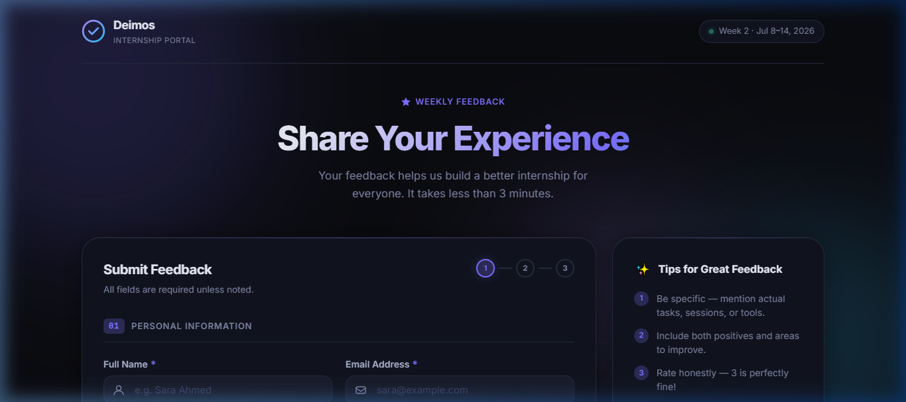
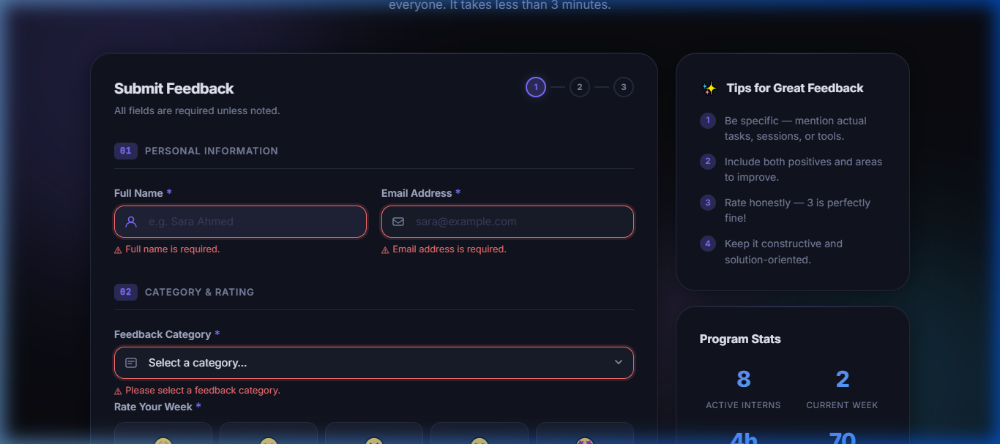
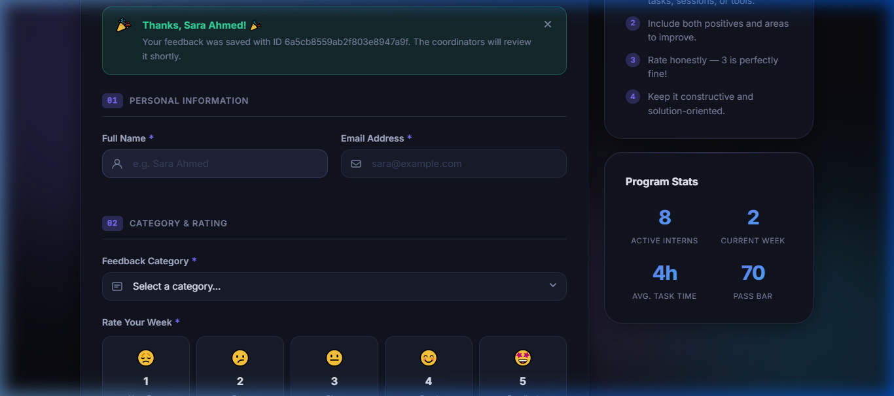
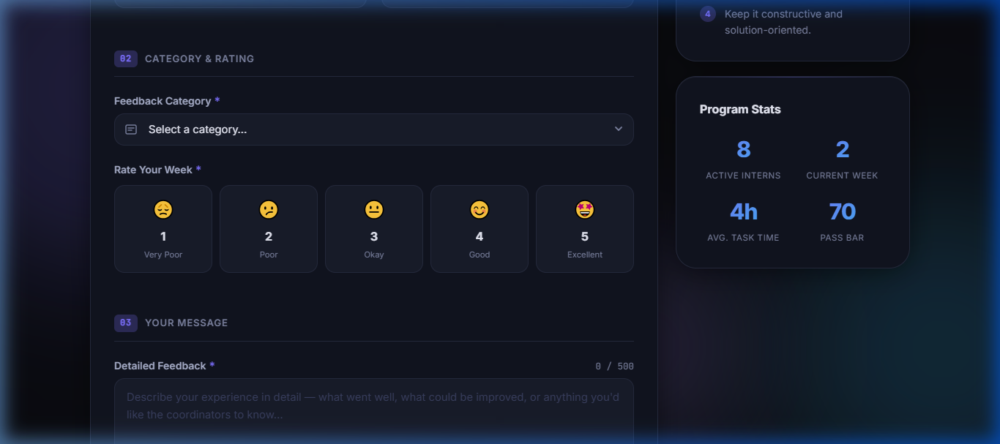
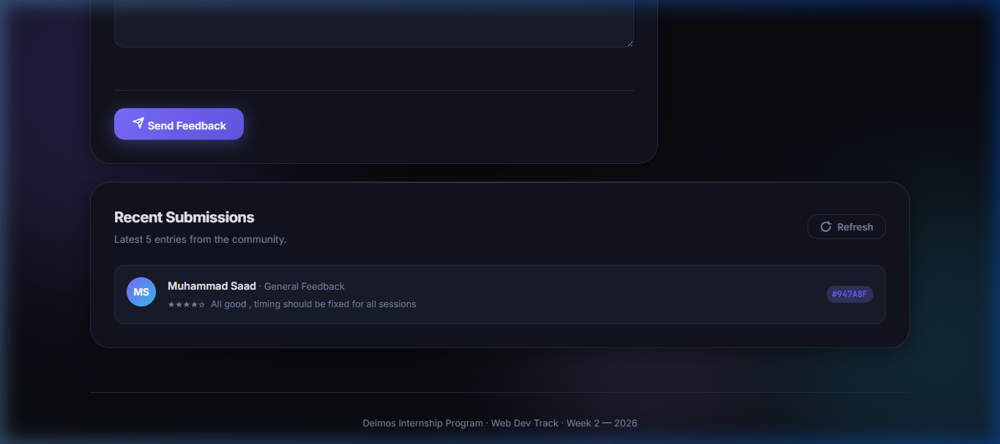

# Intern Feedback Form — Deimos Web Dev Track · Week 2

A premium, dark-themed **Intern Feedback Form** web application that validates user input on the client side, persists it to a live REST API via `fetch()`, and communicates every state (loading → success / error) with polished micro-animations and inline feedback.

---

## 📋 Description

The Deimos program coordinators need a way for interns to submit structured weekly feedback. This form lets an intern enter their name and email, pick a feedback category, rate their week (1–5 via emoji-based radio cards), and write a detailed message. On submit the data is `POST`-ed to a live CRUD API; the intern gets a personalised confirmation that includes the server-returned record ID.

The UI features a fully dark-themed, glassmorphic design with animated background orbs, gradient typography, a step indicator, sidebar tips, and shimmer skeleton loaders — delivering a premium, modern experience.

**Features at a glance:**

| Feature | Details |
|---|---|
| Form fields | Full name · Email · Category (select) · Rating (emoji radio cards) · Message |
| Client-side validation | Inline errors per field with shake animation, no `alert()` popups |
| API integration | `POST` to CrudCrud REST API; checks `response.ok` manually |
| Loading state | Submit button disabled + spinner while request is in-flight |
| Success state | Personalised banner with returned record `id`; form resets |
| Error state | Friendly message shown; user's input is **preserved** for retry |
| Step indicator | 3-step progress dots (Personal Info → Rating → Message) |
| Dark theme | Premium dark UI with design tokens, glassmorphic cards, animated orbs |
| Sidebar | Tips for great feedback + program stats panel |
| Bonus — Recent posts | `GET` latest 5 entries, rendered with shimmer skeleton loader |
| Bonus — Char counter | Live `0 / 500` counter on the message field, colour-coded near limit |
| Bonus — Responsive | Fully usable at 375 px and 1280 px |
| Bonus — Accessibility | ARIA live regions, `prefers-reduced-motion`, focus-visible outlines |

---

## 🚀 How to Run

No build step or dependencies required — it's plain HTML + CSS + JS.

### Option A — Open directly in the browser (simplest)
```
Double-click  index.html
```
> The Google Fonts link requires an internet connection. Everything else works offline (except API calls).

### Option B — Local HTTP server (recommended, avoids any CORS quirks)

**Python 3**
```bash
cd path/to/Week-2
python -m http.server 8765
# then open  http://localhost:8765
```

**Node.js (`npx serve`)**
```bash
cd path/to/Week-2
npx serve .
# then open the URL shown in the terminal
```

**VS Code** — install the *Live Server* extension, right-click `index.html` → *Open with Live Server*.

---

## 🌐 API Used — CrudCrud

**Endpoint:** `https://crudcrud.com/api/<api-key>/feedbacks`

### Why CrudCrud?

1. **Real persistence** — unlike JSONPlaceholder, CrudCrud actually stores and returns submitted data, making the "recent submissions" feature display real entries.
2. **Full CRUD support** — `GET`, `POST`, `PUT`, `DELETE` all work on the same endpoint, enabling the bonus recent-posts feature to show actual submissions.
3. **Unique `_id` field** — every `POST` returns a MongoDB-style `_id`, which the spec requires to show back to the user.
4. **Zero setup** — no account needed, just use the free API key in the URL.

The `POST` call follows the spec exactly:
```js
const response = await fetch(API_URL, {
  method: 'POST',
  headers: { 'Content-Type': 'application/json' },
  body: JSON.stringify({ name, email, category, rating, message }),
});
if (!response.ok) throw new Error(`Server error: ${response.status}`);
const data = await response.json(); // { _id: "6a5cb855...", name: ..., ... }
```

---

## 🎨 Design System

The app uses a fully tokenised dark design system:

| Token | Value | Purpose |
|---|---|---|
| `--bg` | `#0a0b10` | Page background |
| `--bg-card` | `#11141f` | Card surfaces (glassmorphic) |
| `--accent` | `#7c6fff` | Primary accent (purple) |
| `--accent-2` | `#38bdf8` | Secondary accent (blue) |
| `--font` | `Inter` | UI typography |
| `--font-mono` | `JetBrains Mono` | Code / counters |

**Key visual features:**
- 🌀 Animated gradient background orbs
- 💎 Glassmorphic cards with subtle top-edge glow
- 🎨 Gradient hero typography
- ✨ Micro-animations: shake on error, fade-up on cards, shimmer skeletons
- 📱 Responsive grid → single column at 900 px, mobile-optimised at 640 px

---

## 📸 Screenshots

### 1 — Hero & Form (Clean State)
The dark-themed landing with gradient "Share Your Experience" hero, the step-indicator form card, and the sidebar tips panel.



### 2 — Validation Errors
Clicking *Send Feedback* with empty fields triggers inline error messages with red borders and shake animations — no `alert()` dialogs used anywhere.



### 3 — Success State
After a valid submission the green success banner appears with the intern's name and the API-returned record ID. The form automatically resets so a new submission can be started immediately.



### 4 — Rating Cards & Stats Sidebar
Emoji-based rating radio cards (1–5) with glow effect on selection, plus the program stats panel in the sidebar.



### 5 — Recent Submissions
Live list of the 5 most recent submissions fetched from the API, with avatar initials, star ratings, and truncated messages.



---

## 💡 What I Learned / What Was Hard

Building this form reinforced how important it is to treat every async path — not just the happy one — as a first-class UX concern. The trickiest part was remembering that `fetch()` only rejects on network failures, not on `404` or `500` responses, so `response.ok` must be checked explicitly. Structuring client-side validation so that errors appear *inline* next to each field (rather than in a single block or an `alert()`) required thinking carefully about the DOM structure and ARIA live regions to keep the form accessible. Wiring the loading state — disabling the button, showing a spinner, and re-enabling on both success *and* failure — made the async flow tangibly clearer. The bonus character counter was a small feature with outsized UX impact; watching the colour shift as you approach the limit gives instant, useful feedback. Overall, connecting a real form to even a mock API made the request/response cycle feel concrete in a way that reading docs alone never quite does.

---

## 📁 File Structure

```
Week-2/
├── index.html          # Semantic HTML — form, labels, ARIA attributes, SVG icons
├── style.css           # Vanilla CSS — design tokens, dark theme, glassmorphism, responsive
├── script.js           # Validation, fetch(), loading / success / error states
├── screenshots/
│   ├── hero-and-form.png
│   ├── validation-errors.png
│   ├── success-state.png
│   ├── rating-and-sidebar.png
│   └── recent-submissions.png
└── README.md           # This file
```

---

## ✅ Spec Compliance Checklist

- [x] `<label>` linked to every input via `for` / `id`
- [x] Inline validation errors — no `alert()`
- [x] `event.preventDefault()` — page never reloads
- [x] `POST` to REST API with `Content-Type: application/json`
- [x] Submit button disabled during request
- [x] Loading indicator shown while request is in-flight
- [x] Success: personalised message with returned `id`; form resets
- [x] Error: friendly message; user input preserved for retry
- [x] `response.ok` checked manually
- [x] Plain HTML + CSS + JS — no jQuery, no framework
- [x] Files: `index.html`, `style.css`, `script.js`
- [x] **Bonus** — GET recent posts rendered below the form
- [x] **Bonus** — Character counter on message field
- [x] **Bonus** — Responsive at 375 px and 1280 px
- [x] **Bonus** — Accessible (ARIA live regions, reduced-motion, focus-visible)
- [x] **Bonus** — Premium dark theme with design tokens and animations

---

*Deimos Internship Program · Web Dev Track · Week 2 · Jul 8–14, 2026*
